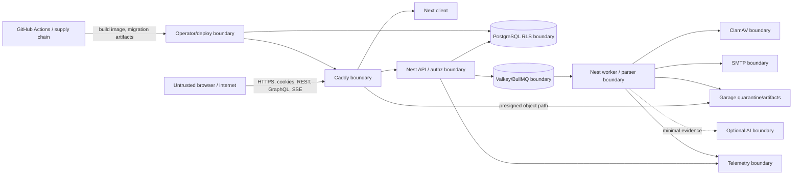

# Acres security and threat model

Status: repository-grounded threat model, reviewed for the **current** code and
the **target** architecture approved 2026-08-23. It is not a penetration test,
certification, compliance claim, or assertion that target controls are shipped.

## Provider acquisition boundary — Phase 7B

geoBoundaries discovery and artifact responses are untrusted. The operator CLI
constructs selection-only `gbOpen` discovery paths, rejects redirects and
non-HTTPS/unknown hosts, applies timeout/content-type/byte limits, and records
only commit-addressed artifact URLs with SHA-256 and byte length. Manifest,
metadata, GeoJSON identity and geometry are fail-closed before a single
transactional PostGIS publication. Logs exclude geometry, credentials, query
strings and response bodies. Remaining risk includes upstream compromise and
the legal/political status of provider data; retained provenance supports review
but does not eliminate either risk.

Deep hierarchy input is separately untrusted: every child must map exactly once
to an existing immediate parent in the same checksummed manifest, and an
existing-parent conflict aborts the complete transaction. This is integrity
evidence only, not a political or legal authority determination.

## 1. Executive summary

Acres' highest-risk property is organization isolation: one authenticated
customer must never obtain another customer's uploads, observations, reports,
exports, jobs, or AI context. The next largest attack surface is the proposed
untrusted-file pipeline, where malicious files can target object keys,
scanners, parsers, spreadsheets, workers, and availability. GraphQL, queues,
presigned storage, CI/migrations, and optional AI add powerful boundaries that
must be introduced only with the negative tests assigned below.

The current API has meaningful controls—opaque hashed sessions, secure
cookie attributes in production, global double-submit CSRF, a same-origin Next
API bridge for browser auth/organization traffic, strict DTO validation,
exact-origin credentialed CORS, Helmet, password hashing, generic errors,
throttling, server-side revocation, organization memberships,
centralized organization permissions, hash-only invitations/account tokens,
append-oriented organization audit events, transaction-local tenant context and
forced RLS on tenant product tables, authenticated read-only GraphQL, a worker
path for ingestion/export jobs, object-storage metadata and adapters, bounded
uploads, analytics/dashboard reads, immutable report evidence,
formula-safe CSV exports, and SSE job progress streams. It has an optional
disabled-by-default AI assistive draft preview (Phase 11A) using the unpaid
Gemini Developer API with mandatory disclosure/acknowledgment, which is strictly
excluded from the production launch profile. Target controls such as production
topology, live volume encryption, and operator readiness records remain gates,
not present-day production facts.

## 2. Scope and assumptions

In scope:

- the current Next client, Nest API, Prisma/PostgreSQL boundary, shared
  contracts, Docker image, and GitHub Actions workflow;
- target organization tenancy, REST, GraphQL, SSE, uploads, Garage,
  Valkey/BullMQ, worker, ClamAV, SMTP, telemetry, optional local AI, Compose,
  Caddy, backups, CI, and migration identities;
- application, operator, dependency, and supply-chain failure paths.

Out of scope until separately selected: a cloud/provider edge, Kubernetes,
mobile apps, public anonymous sharing, customer plugins, paid billing, SSO/SCIM,
and unnamed public-data connectors. Physical host security and organizational
personnel controls are operator responsibilities but remain relevant inputs.

Assumptions requiring later validation:

- production is same-origin HTTPS behind a correctly configured Caddy instance;
- stateful dependencies are private and authenticated;
- the operator can maintain off-host encrypted backups and separate runtime
  from migration credentials;
- uploaded business data is confidential unless an organization deliberately
  publishes a future surface;
- exact retention, SLO, RPO/RTO, upload limits, and alert thresholds are not yet
  chosen;
- no compliance regime or geography-specific legal obligation is claimed.

## 3. System model and trust boundaries

Trust is not transitive. A valid session does not imply membership, membership
does not imply every permission, a signed upload URL does not make bytes safe,
a queue message does not make work authorized, and a local AI process does not
make output factual.

## 4. Assets and data classes

| asset                                                                           | security property                                                                                            |
| ------------------------------------------------------------------------------- | ------------------------------------------------------------------------------------------------------------ |
| Tenant business data, uploads, observations, dashboards, reports, exports       | Confidentiality between organizations; integrity, provenance, and availability within the owner organization |
| Accounts, contact PII, memberships, invitations                                 | Confidentiality, correct identity binding, revocation, minimized disclosure                                  |
| Password hashes, raw session/CSRF tokens, service credentials, signing material | Non-disclosure, rotation, least privilege; raw tokens never persisted/logged                                 |
| Geography and metric definitions                                                | Provenance, license, integrity, stable identity; public geography does not weaken tenant data isolation      |
| Dataset versions and evidence links                                             | Immutability, reproducibility, source/version integrity                                                      |
| Audit events and security logs                                                  | Append-oriented integrity, restricted access, useful correlation without secrets                             |
| Queue/outbox/job state                                                          | Authenticity, idempotency, replay resistance, recoverability                                                 |
| Migrations, images, dependencies, CI workflows                                  | Supply-chain integrity and controlled promotion                                                              |
| Optional AI prompts, evidence, drafts, model/license records                    | Tenant confidentiality, evidence grounding, human authority                                                  |
| Backups                                                                         | Confidentiality, completeness, restorability, controlled deletion                                            |

Classification details are owned by [`product.md`](product.md#5-data-classification).

## 5. Actors and attacker model

- An unauthenticated internet attacker can send arbitrary HTTP requests, forge
  headers, submit public forms/auth attempts, and manipulate client-visible
  parameters. They do not initially possess host or database credentials.
- A legitimate viewer/analyst/admin can inspect client traffic and guess UUIDs,
  manipulate GraphQL/REST inputs, replay commands, upload hostile files, and
  intentionally cross tenant boundaries. Their valid account is not trusted.
- A malicious or compromised dependency/service can return crafted mail,
  scanner, storage, queue, telemetry, or AI data. Private networking reduces
  reachability but does not validate payloads.
- A compromised browser/XSS or stolen session can act with the victim's current
  permissions. HttpOnly cookies reduce token theft but not same-origin actions.
- A CI contributor or compromised package/action can attempt secret theft or
  artifact tampering. Branch protections and external platform settings are not
  visible here and must be verified.
- An operator/migration identity is highly privileged. The model limits and
  audits it but cannot protect against a fully malicious root administrator.
- Attackers are not assumed to break modern cryptography, a correctly
  implemented password hash, or TLS. Availability attacks are bounded by
  capacity, not made impossible.

## 6. Entry points and boundary controls

| entry point              | current evidence                                                                                                                                                                                                                                                                                                                                          | target gate                                                                                                                                        |
| ------------------------ | --------------------------------------------------------------------------------------------------------------------------------------------------------------------------------------------------------------------------------------------------------------------------------------------------------------------------------------------------------- | -------------------------------------------------------------------------------------------------------------------------------------------------- |
| REST/auth/session        | `/api/v1` product routes; DTO allowlist; opaque SHA-256 session token hashes; cost-12 bcrypt passwords; revocation; selected organization commands require scoped idempotency keys and responses carry safe request IDs                                                                                                                                   | Same-origin proxy trust review, distributed throttling and future stale-write/version contracts                                                    |
| Cookies/CSRF/CORS        | `HttpOnly`, `SameSite=Lax`, production `Secure`; session-bound double-submit token; exact configured origin; credentialed allowed headers/methods                                                                                                                                                                                                         | Same-origin Caddy; canonical origin; CSRF rotation regression; proxy trust review; no state-changing GET                                           |
| GraphQL                  | Authenticated read-only `/graphql`; selected-organization context; same permission/application services as REST; request-scoped DataLoader caching; pre-parse byte/depth/alias/complexity/result/execution-time limits; transaction-local DB cancellation; sanitized errors; no mutations/subscriptions; dashboard summary read model                     | Broader query-count matrix as read models grow                                                                                                     |
| SSE                      | Implemented for exports (`GET /api/v1/exports/:exportId/events`) and ingestion runs (`GET /api/v1/ingestion-runs/:runId/events`). Authenticated session, active organization context, scoped permission guards (`exports.read`, `ingestion.read`), pre-stream 404/403 validation, low-risk event IDs, terminal state disconnection, and fallback polling. | Authorized status only, reconnect cursor where needed, bounded connections, durable PG state independent of stream                                 |
| Upload/presigned storage | Not present                                                                                                                                                                                                                                                                                                                                               | Short expiry/method/key; quarantine; checksum/type/size/shape checks; scan before parse; attachment downloads                                      |
| Parsers/worker           | Not present                                                                                                                                                                                                                                                                                                                                               | Isolated staged jobs; memory/CPU/time/expansion/geometry bounds; identifier-only payloads; idempotency and cancellation                            |
| Queue/outbox             | Not present                                                                                                                                                                                                                                                                                                                                               | Private authenticated `noeviction` Valkey; deterministic job IDs; PG outbox; replay/poison/dead-letter handling                                    |
| SMTP                     | Not present                                                                                                                                                                                                                                                                                                                                               | Provider-neutral adapter, recipient/content validation, throttling, no credentials/content in logs                                                 |
| Optional AI              | Not present                                                                                                                                                                                                                                                                                                                                               | Disabled by default; tenant-bound minimal evidence; schema validation; no tools/mutation/publication; evaluation and human decision                |
| Logs/metrics             | Nest logs exist; generic client 500s; no canonical telemetry stack                                                                                                                                                                                                                                                                                        | Structured redaction; low-cardinality metrics; access-controlled telemetry; raw data/prompts excluded by default                                   |
| CI/dependencies/images   | Lockfile, `npm ci`, least `contents: read`, build/test, non-root server image, Phase 12A operations preflights, tracked-file default/secret-pattern scan, and static Docker runtime check                                                                                                                                                                 | Pin/review actions/images, dependency/container/SAST beyond local deterministic scans, provenance, protected promotion, rotated deploy credentials |
| Migrations/database      | Local/CI PostgreSQL + PostGIS, separate migrator/runtime/test roles, committed first Prisma migration, pending-migration readiness, and real-database integration tests                                                                                                                                                                                   | Production host/encryption/backups; RLS/PostGIS tenant-isolation tests                                                                             |

Current evidence anchors include `server/src/app.setup.ts`,
`server/src/security/csrf.service.ts`, `server/src/sessions/sessions.service.ts`,
`server/src/security/rate-limit.guard.ts`, `server/src/config/env.validation.ts`,
`server/src/common/api-exception.filter.ts`, `.github/workflows/ci.yml`, and
`server/Dockerfile`. Phase 8 adds forced-RLS analytics tables and centralized
`analytics.read` REST access; see [`analytics.md`](analytics.md). Phase 9 adds
forced-RLS saved dashboard views, `dashboards.manage`, and the authenticated
dashboard GraphQL/UI path; see [`dashboards.md`](dashboards.md).

## 7. Prioritized abuse paths

1. **Cross-tenant direct-object access.** A member guesses another tenant's
   UUID through REST, GraphQL node lookup, export, object URL, relation, or job.
   Impact is critical confidentiality/integrity loss. Phase 3 must establish
   two-layer isolation; every later surface adds negative tests.
2. **Role or organization-context escalation.** A member changes role,
   organization ID, invitation, active-org header, or stale membership to run a
   forbidden command. Central policy, transaction tenant context, last-owner
   rules, revocation, and audit are the target.
3. **Session-assisted state change.** A stolen session or cross-site request
   performs a mutation. Current HttpOnly/SameSite/CSRF controls reduce risk;
   XSS, stale tokens, origin/proxy mistakes, recovery and org permissions still
   need phase-specific tests.
4. **Malicious upload to parser execution/exhaustion.** Crafted archives,
   spreadsheets, GeoJSON, or type confusion consume CPU/memory/disk or exploit
   a parser. Quarantine, scan-before-parse, content checks, strict budgets,
   process isolation, dependency scanning, and fail-closed stages are required.
5. **Storage key/signature manipulation.** A member alters a key, method,
   checksum, or presigned URL to overwrite/read a foreign object. The API must
   derive opaque keys, bind DB ownership, constrain signatures, and reconcile
   storage with metadata.
6. **GraphQL amplification and inference.** Aliases/fragments/deep pagination
   amplify DB work or global IDs reveal foreign existence. Per-request tenant
   authorization, complexity/depth/result/time limits, batching, opaque cursors,
   and indistinguishable not-found behavior bound it.
7. **Queue poisoning or replay.** Forged, duplicated, stale, or enormous jobs
   cause unauthorized or duplicate persistence. Private/authenticated Valkey,
   identifier-only versioned payloads, deterministic job IDs, state re-checks,
   outbox identity, idempotent stages, and dead-letter inspection are required.
8. **Spreadsheet formula injection.** A malicious cell is emitted into CSV/XLSX
   and executes when opened. Export policy must neutralize formula-leading text,
   use safe content disposition, and include fixture tests.
9. **SSRF through a connector, webhook, import, or AI tool.** No arbitrary URL
   fetch exists in the target core. Any later adapter must restrict protocols,
   allowlist destinations, block private/metadata networks after DNS resolution,
   cap redirects/body/time, and never forward cookies/secrets.
10. **AI prompt injection or data leakage.** Dataset text manipulates a model or
    evidence from another tenant enters context/logs. AI has no tools/authority,
    receives only authorized evidence, validates output, runs leakage/grounding
    evaluation, and falls back to no-AI behavior.
11. **Secret or audit compromise.** CI/log/config/image mistakes expose tokens,
    or a privileged actor edits evidence. Secret scanning/injection/rotation,
    separated credentials, redaction, append-oriented audit, protected backups,
    and alerts reduce impact.
12. **Targeted availability attack.** Auth, GraphQL, uploads, parsers, export,
    email, or AI consumes finite resources. Layered rate/size/concurrency/time
    limits, backpressure, queues, circuit breakers, disk signals, and graceful
    degradation protect core reads.

## 8. Threat register

| ID    | threat / affected assets                                       | likelihood / impact      | existing control                                                                                                                                                                                                                                                                                                                                                                                                                                                                                                                                                                                                                                                                                                                                                                                                                                                                                                                | target mitigation and validation                                                                                                                                                                                                                                                  | owner               |
| ----- | -------------------------------------------------------------- | ------------------------ | ------------------------------------------------------------------------------------------------------------------------------------------------------------------------------------------------------------------------------------------------------------------------------------------------------------------------------------------------------------------------------------------------------------------------------------------------------------------------------------------------------------------------------------------------------------------------------------------------------------------------------------------------------------------------------------------------------------------------------------------------------------------------------------------------------------------------------------------------------------------------------------------------------------------------------- | --------------------------------------------------------------------------------------------------------------------------------------------------------------------------------------------------------------------------------------------------------------------------------- | ------------------- |
| TM-01 | Cross-tenant read/write through ID, relation, export, or job   | High / Critical          | Phase-3 organization tables have scoped services, transaction-local settings and `ENABLE/FORCE RLS`; real DB tests cover default-deny and foreign/absent not-found for organizations                                                                                                                                                                                                                                                                                                                                                                                                                                                                                                                                                                                                                                                                                                                                            | Extend the same negative matrix through GraphQL/job/export/object surfaces as they ship                                                                                                                                                                                           | Phase 4/6–10        |
| TM-02 | Role escalation, invitation replay, last-owner removal         | Medium / High            | Central permission map, non-owner generic role assignment, expiring hash-only invites, audit, and forced-RLS last-owner trigger are implemented. Prompt 55 proves serialized competing ownership transfers and active last-owner enforcement. Prompt 56 exhaustively checks the administration and role-assignment matrices and adds real PostgreSQL evidence for role changes, soft revocation and same-row reactivation, duplicate/revoked/replacement invitations, recipient/expiry/state binding, and concurrent single-use acceptance. Prompt 57 adds a session-protected browser acceptance path: it sends CSRF plus a fresh idempotency key without client-supplied organization context, uses one generic unavailable state, and keeps the raw token out of browser location/storage/rendered feedback. Failed commands leave no durable idempotency record; audits and persisted invitation rows contain no raw token. | Invitation issuance UI, mail delivery/recovery, and distributed operational policy remain later work; retain the lifecycle, browser token-safety, and concurrency gates in CI/staging                                                                                             | Phase 3 follow-up/5 |
| TM-03 | Session theft/fixation/replay or weak recovery                 | Medium / High            | CSPRNG opaque session tokens, DB hashes, HttpOnly/Lax/Secure, expiry/revocation; login creates a new token. Prompt 57 resolves the invitation page session server-side, uses a fixed safe sign-in return path, and discards the pasted token rather than carrying it through reauthentication. Prompt 58 implements provider-neutral mail delivery and the public password recovery journey: `POST /api/v1/auth/reset-password` atomically consumes single-use SHA-256 tokens, sets cost-12 bcrypt password hash, revokes all active sessions for the account (`revokeAllForAccount`), and cleans up outstanding recovery tokens. On mount, `/reset-password` cleans the bearer token from browser URL history via `window.history.replaceState` to prevent leakage in referrers and logs. | Public recovery route, mail delivery adapter, all-session revocation, and URL token scrubbing implemented in Phase 5C; invitation issuance and invitation mail delivery remain Phase 5 follow-up                                                                                  | Phase 5/mail        |
| TM-04 | CSRF or origin/proxy bypass                                    | Medium / High            | Global session-bound double-submit CSRF, exact CORS, SameSite                                                                                                                                                                                                                                                                                                                                                                                                                                                                                                                                                                                                                                                                                                                                                                                                                                                                   | Same-origin routing, canonical host/origin, proxy trust and mutation inventory tests, token refresh on login                                                                                                                                                                      | Phase 5/12          |
| TM-05 | Password/account enumeration or credential stuffing            | High / Medium            | Generic register/login failure, cost-12 bcrypt, strict per-IP throttle. Prompt 58 implements anti-enumeration timing protection on `POST /api/v1/auth/forgot-password` with dummy bcrypt verification timing on non-existent accounts and identical generic success responses (`{ accepted: true }`) regardless of account presence; client UI displays identical confirmation copy. Prompt 66 implements `scripts/ops/run-dos-resilience-drill.sh` validating `@StrictThrottle()` on sensitive auth and contact endpoints (10 req/min), fail-closed HTTP 429 `RATE_LIMITED` responses, `@SkipThrottle()` on `/health` and `/metrics` (preventing DoS probe starvation), and `High429Rate` Prometheus alert detection for credential stuffing attempts. | Distributed/user+IP throttle, recovery abuse controls, alerts; enumeration/timing and rate tests implemented for auth recovery and credential stuffing defense | Phase 3/5/12        |
| TM-06 | Malicious upload/type confusion/malware                        | High / High              | Uploads absent                                                                                                                                                                                                                                                                                                                                                                                                                                                                                                                                                                                                                                                                                                                                                                                                                                                                                                                  | Quarantine, signature/type/extension/checksum checks, ClamAV fail closed, no inline active content; hostile fixtures                                                                                                                                                              | Phase 6             |
| TM-07 | Archive/parser/geometry resource exhaustion                    | High / High              | Streaming/byte ceilings, row/column/cell/feature/coordinate limits; XLSX pre-parse encryption/macro container inspection; single-use child-process execution without app context or credentials, 15s watchdog timeout, 192MB heap ceiling, untrusted IPC validation; fail-closed blocking validation issues; pre-SQL GeoJSON validation (finite bounds, 2D only, rings closed, nesting depth <= 6, coordinates <= 100k) and PostGIS ST_IsValid topological rejection                                                                                                                                                                                                                                                                                                                                                                                                                                                            | OS/container sandbox (gVisor/seccomp), container isolation, external provider import verification                                                                                                                                                                                 | Phase 6/7           |
| TM-08 | Object-key traversal, foreign overwrite/read, signature replay | Medium / Critical        | Object storage absent                                                                                                                                                                                                                                                                                                                                                                                                                                                                                                                                                                                                                                                                                                                                                                                                                                                                                                           | Server-derived org/upload keys, method/expiry/checksum binding, metadata auth, attachment response; tamper/cross-org tests                                                                                                                                                        | Phase 6             |
| TM-09 | Spreadsheet formula injection or stored UI XSS                 | Medium / High            | React escapes current fixed content; no product export                                                                                                                                                                                                                                                                                                                                                                                                                                                                                                                                                                                                                                                                                                                                                                                                                                                                          | Formula neutralization, structured rendering, no raw HTML/SVG, CSP; export/open and browser sink tests                                                                                                                                                                            | Phase 5/10          |
| TM-10 | GraphQL complexity, N+1, data inference, verbose errors        | Medium / High            | Phase 4 adds authenticated read-only GraphQL, tenant membership context, bounded DB windows, request-scoped loader caching, POST-only operation handling, pre-parse byte/depth/alias/complexity/result/execution-time caps, transaction-local DB cancellation and sanitized `extensions.code`/request IDs                                                                                                                                                                                                                                                                                                                                                                                                                                                                                                                                                                                                                       | Broaden adversarial query-count fixtures as read models grow                                                                                                                                                                                                                      | Phase 9             |
| TM-11 | Queue poisoning/replay or stale authorization                  | Medium / High            | Queue absent                                                                                                                                                                                                                                                                                                                                                                                                                                                                                                                                                                                                                                                                                                                                                                                                                                                                                                                    | Private authenticated queue, identifier-only schema, deterministic IDs, re-authorize against PG, idempotency/dead letter; replay/poison tests                                                                                                                                     | Phase 6             |
| TM-12 | Outbox loss/duplicate delivery or split-brain state            | Medium / High            | Current jobs are DB reads/in-process schedule                                                                                                                                                                                                                                                                                                                                                                                                                                                                                                                                                                                                                                                                                                                                                                                                                                                                                   | Transactional outbox, claim locks, unique event/handler identity, reconciliation; crash-after-commit/duplicate tests                                                                                                                                                              | Phase 6             |
| TM-13 | SSRF through future URLs/webhooks/connectors                   | Low now / High           | No such fetch path evidenced                                                                                                                                                                                                                                                                                                                                                                                                                                                                                                                                                                                                                                                                                                                                                                                                                                                                                                    | Default no arbitrary fetch; protocol/host/IP allowlists, DNS recheck, redirect/body/time limits; private-network fixtures                                                                                                                                                         | Owning future phase |
| TM-14 | AI injection, unsupported claim, cross-tenant leakage          | Medium if enabled / High | Phase 11A disabled-by-default with unpaid Developer API disclosure/acknowledgment; minimal tenant-scoped evidence context in XML delimiters; schema validation + citation allow-list check; prompt version + canonical SHA-256 input hash audit row without raw prompt/output persistence; human-in-the-loop review/saving; synthetic injection/leakage/citation evaluation suite                                                                                                                                                                                                                                                                                                                                                                                                                                                                                                                                               | Production launch strictly excludes unpaid Gemini preview; requires AI_DRAFT_ENABLED=false, no GEMINI_API_KEY in production secrets, and deterministic no-AI verification                                                                                                         | Phase 11A / 12D     |
| TM-15 | Secrets in client, git, image, CI output, queue, or logs       | Medium / Critical        | Env validation; client uses a server-only `ACRES_API_ORIGIN` and stores no session token or CSRF secret; CI read-only contents; Phase 12A scans tracked files for known local defaults, `change-me` placeholders outside approved examples, launch sentinels outside docs/examples, and secret-looking `NEXT_PUBLIC_*` names. Prompt 64 implements `scripts/ops/run-secret-rotation-drill.sh` executing zero-downtime rotation drills across 7 secret classes with structured JSON evidence (`backups/secret-rotation-evidence-*.json`). Prompt 65 implements `scripts/ops/run-sast-scan.js` (SAST-04 hardcoded secret scanner) and `scripts/ops/verify-container-security.js` (layer hygiene checking zero inclusion of `.env`, `*.pem`, `*.key`, or root credentials in container images). | Secret manager/injection, scoped identities, deeper SAST/dependency/container scanning, redaction, rotation drill; artifact/image/log inspection                                                                                                                                  | Phase 2/5/6/12      |
| TM-16 | Audit alteration or sensitive audit leakage                    | Medium / High            | Organization `AuditEvent` is append-oriented for runtime roles; update/delete are not granted, and tests/catalog checks cover forced RLS and privileges                                                                                                                                                                                                                                                                                                                                                                                                                                                                                                                                                                               | Retention, alerting, backup integrity and later product audit surfaces remain phase 12/later work                                                                                                                                                                                 | Phase 12            |
| TM-17 | SQL injection or RLS bypass via raw PostGIS SQL                | Medium / Critical        | Tenant context uses tagged Prisma raw SQL; runtime/test roles are non-owner/no `BYPASSRLS`; forced RLS is catalog-tested; PostGIS geography repository uses tagged Prisma SQL templates with parameterized bindings, `ST_SetSRID(ST_GeomFromGeoJSON(...), 4326)`, `ST_IsValid`/`ST_IsEmpty`/`ST_GeometryType` evaluation, deterministic upsert on `(regionId, sourceId)`, GiST index bounding box prefiltering (`&&`), and `EXPLAIN (ANALYZE, BUFFERS, FORMAT JSON)` index proof test harness                                                                                                                                                                                                                                                          | Provider geography import scripts and non-PostGIS analytic dynamic SQL remain subject to continuous review                                                                                                                                                                        | Phase 7/12          |
| TM-18 | Dependency/action/container supply-chain compromise            | Medium / Critical        | npm lockfile/`npm ci`, CI `contents: read`, non-root image. Prompt 63 implements `scripts/ops/run-deployment-drill.sh` verifying non-destructive additive migrations, graceful shutdown drain (`stop_grace_period`: Caddy 30s, Next 30s, API 45s, Worker 60s), and parameterizable image rollback. Prompt 65 implements deterministic CycloneDX v1.5 JSON SBOM generation with license compliance verification (`scripts/ops/generate-sbom.js`), pure Node.js SAST scanning (`scripts/ops/run-sast-scan.js`) with fail-closed triage policy (`infra/security/sast-triage.json`), and static container image/Compose hardening verification (`scripts/ops/verify-container-security.js`).                                                                                                                             | Pin/review actions/images, dependency/container/SAST/secret scans, artifact provenance and controlled promotion                                                                                                                                                                   | Phase 12            |
| TM-19 | Backup theft, incomplete restore, or destructive migration     | Medium / Critical        | No production DB/backups/migration                                                                                                                                                                                                                                                                                                                                                                                                                                                                                                                                                                                                                                                                                                     | Separate migration role, reviewed SQL, encrypted off-host backup, scheduled restore/reconcile, forward-fix plan                                                                                                                                                                   | Phase 2/12          |
| TM-20 | Targeted DoS across auth/query/upload/worker/storage           | High / High              | In-process per-IP throttling and body validation; GraphQL pre-parse byte/depth/alias/complexity/result/timeout caps. Prompt 63 implements `scripts/ops/verify-caddy-routing.js` validating Caddy edge ingress, body caps (`$ACRES_MAX_REQUEST_BODY`), transport timeouts (`read_timeout`, `write_timeout`, `dial_timeout`), security headers (`X-Content-Type-Options`, `X-Frame-Options`, `Referrer-Policy`, `Permissions-Policy`, `-Server`), and S3 SigV4 Host header preservation for Garage. Prompt 66 implements pure Node.js capacity evaluation engine (`scripts/ops/verify-capacity-load.js` & `.spec.js`) evaluating Category 5 SLOs (availability >= 99.9%, p95 latency <= 500ms, throughput >= 100 RPS under concurrency), Prometheus alert expansion and simulation (`scripts/ops/verify-alert-rules.js` & `.spec.js`) verifying 7 golden signal and threat rules (`AcresApiDown`, `HighHttp5xxRate`, `P95LatencyThresholdExceeded`, `High429Rate`, `QueueDeadLettersDetected`, `OutboxDeliveryLag`, `DatabaseConnectionPoolSaturation`), and automated multi-layer DoS resilience drill runner (`scripts/ops/run-dos-resilience-drill.sh` & `scripts/ops/run-capacity-alerting-drill.sh`). | Caddy limits, distributed throttles, concurrency/backpressure, capacity alerts and degraded modes; automated load, capacity, DoS resilience, and alert simulation drill verified | Phase 6/12          |
| TM-21 | Offline disclosure of live database/object volumes or keys     | Medium / Critical        | Prompt 64 implements `scripts/ops/verify-volume-encryption.js` and `verify-volume-encryption.spec.js` enforcing encrypted mount path declarations across all 9 stateful container mounts (Postgres, Valkey, Garage meta/data, ClamAV, Caddy data/config, Prometheus, Grafana), approved mechanisms (LUKS2/dm-crypt, AWS KMS, GCP CMEK, Azure Key Vault), Key Separation Invariant (scanning data mounts, backups, and Git tracking for keyfiles), and recovery governance.                                                                                                                                                                                                                                                   | Production host/block-volume encryption for PostgreSQL and Garage; operator-owned keys separate from data/backups; mount/key-recovery inspection                                                                                                                                  | Phase 2/6/12        |
| TM-22 | Concurrent duplicate command or changed-body replay            | Medium / High            | Duplicate-producing commands use bounded printable-ASCII keys, domain-separated SHA-256 key/body digests, principal/org/operation scope, forced-RLS records, expiry, stored successful responses, and a null-safe unique index. Prompt 54 replaces transaction-poisoning catch-after-`P2002` recovery with Prisma's parameterized `createMany({ skipDuplicates: true })` insert-or-observe path; its 23-case isolated suite covers validation, canonicalization, replay, fail-closed conflicts, rollback, database failures, and duplicate-winner outcomes                                                                                                                                                                                                                                                                                                                                                                      | Live concurrent PostgreSQL race gate executed against migrated `acres_test` in `database.e2e-spec.ts` on 2026-09-05; simultaneous requests produce one durable effect, identical 201 responses, and one succeeded record, with safe replay and 409 conflict. Retain in CI/staging | Phase 4/12          |

## 9. Security acceptance suite

Before launch, automated evidence must include:

- two-organization negative CRUD and relation tests at repository, REST,
  GraphQL, export, object, pooled-connection, and worker boundaries;
- a complete role-permission matrix, invitation expiry/replay, concurrent
  ownership changes, revocation, session expiry, CSRF rotation, and account
  enumeration tests;
- object-key/signature/checksum/size/type tampering, malware, scan timeout,
  archive expansion, parser resource, malformed XLSX/CSV/GeoJSON, and orphan
  reconciliation fixtures;
- queue duplicate/replay/poison/stale-auth, crash-after-commit, outbox recovery,
  dead-letter, cancellation, and graceful-drain tests;
- GraphQL depth/complexity/alias/oversize/timeout/cursor/global-ID/error-leak
  cases plus measured query-count assertions; transaction-level database
  cancellation remains a hardening option before heavier dashboard/report read
  models;
- formula injection, untrusted text/URL rendering, CSP/security-header runtime,
  cached prior-organization data, and accessible error/status browser tests;
- SQL injection/static analysis, dependency/secret/container scans, CI
  permission review, image content/non-root checks, and credential-rotation drill;
- backup restore from the migration chain followed by DB/object reconciliation;
- production volume-encryption configuration and separation of unlock material,
  plus a documented key-recovery exercise that does not expose the key in CI;
- if AI is enabled: cross-tenant canaries, prompt injection, unsupported claims,
  output schema/size, timeout/circuit breaker, raw-prompt log scan, human publish,
  and complete no-AI regression.

Tests must run against real PostgreSQL for constraints/RLS and real browsers for
client security behavior. Mocks can isolate units but cannot prove a boundary.

## 10. Critical review paths

Every phase review should trace at least these end to end:

- principal → active organization → permission → repository → transaction-local
  RLS context → response;
- upload authorization → signed key → quarantine → scan → bounded parse →
  immutable publish → evidence;
- PostgreSQL commit → outbox claim → queue delivery → idempotent worker → job
  status/reconciliation;
- metric definition → observation/version → dashboard/report evidence → export;
- CI source/dependency → build artifact → migration identity → runtime identity;
- optional evidence selection → AI adapter → schema/grounding evaluation → human
  publication, with the adapter removed to prove fallback.

Open values from §2 must be resolved by the phase that first needs them. If a
new boundary or attacker capability is introduced, update this threat model in
the same change.

## 11. Phase 6 boundary update

As of 2026-08-24, upload/storage/queue/worker controls have moved from absent
to partially implemented:

- Upload commands require session auth, selected organization context,
  centralized `uploads.*` permissions, CSRF on mutations, and idempotency keys
  on duplicate-producing commands.
- Object keys are server-derived opaque paths under the organization quarantine
  prefix; raw filenames are stored only as metadata and used in sanitized
  attachment disposition for accepted downloads.
- The browser receives presigned PUT/GET URLs only. Storage access key and
  secret key stay in server/worker environment config and production rejects
  placeholder values.
- New upload/object/outbox/job tables enable and force RLS and default-deny
  without `acres.organization_id`, matching the existing tenant boundary.
- The worker claims outbox rows, records PostgreSQL `DurableJob` state before
  queue publish, enqueues deterministic BullMQ jobs, re-reads database state
  before transitions, records progress, reads object bytes through the storage
  port, finalizes success/failure/cancellation in PostgreSQL, and rejects
  scanner/object failures fail-closed.
- Upload completion verifies object byte count, object media type when present,
  and SHA-256 of the stored bytes outside the database transaction before
  re-checking state and writing the completed state.
- Outbox and worker reads use transaction-local `acres.worker_access`; ordinary
  tenant transactions clear that setting before tenant work.

Residual Phase 6 risks:

- Docker was unavailable in the execution environment, so real Garage, Valkey,
  ClamAV, migration-apply, restart, orphan, and production-volume checks still
  need to run on a Docker-capable host.
- The current worker reads quarantined object bytes through the storage port
  before scanning, but hostile fixtures, archive/parser budgets, and parser
  isolation remain target controls for the ingestion phase.
- Outbox claim leases, retry backoff, dead-letter audit trail creation, worker
  fail-closed malware quarantine/object missing rejection, mid-scan cancellation,
  and scheduled retention maintenance reconciliation (stale upload garbage
  collection, expired tokens/invitations, idempotency records) are verified
  with unit test suites (`outbox.service.spec.ts`, `upload-worker.service.spec.ts`,
  `retention-maintenance.job.spec.ts`). Continuous live multi-node crash-recovery
  remains subject to operational staging verification.

## 12. Phase 7A boundary update

As of 2026-08-29, the first ingestion/parser/PostGIS controls have moved from
target to partly implemented. The implementation record is
[`ingestion.md`](ingestion.md).

- Dataset, mapping, ingestion-run, validation-issue, staged-summary, and
  dataset-version routes require session auth, selected organization context,
  centralized `datasets.*` / `ingestion.*` permissions, CSRF on mutations, and
  idempotency keys on duplicate-producing commands.
- New tenant ingestion tables enable and force RLS with the same
  transaction-local organization and worker-access model as uploads.
- Composite tenant foreign keys prevent cross-organization ingestion
  references even when a worker-scoped write bypasses ordinary tenant context.
- Parser adapters are isolated from Prisma writes. They return bounded
  summaries and validation issues rather than raw rows in PostgreSQL; mapped
  region validation checks every parser-accepted validation row, not just
  preview samples.
- CSV and XLSX use verified MIT packages (`csv-parse`, `read-excel-file`, `fflate`);
  XLSX inspects archive metadata and rejects encrypted OLE packages, macro
  payloads (`xl/vbaProject.bin`), and excessive entry counts before workbook parsing.
  GeoJSON inspection is local and bounded rather than delegated to the older
  LGPL validator package considered during implementation.
- Temporary parser limits are explicit environment values for rows, columns,
  cell text length, sampled rows, GeoJSON features, and coordinate counts.
- Worker ingestion publication re-reads authoritative PostgreSQL state, skips
  cancelled/published runs, replaces retry issues/summaries, and publishes at
  most one immutable dataset version for a dataset/upload/mapping tuple.
- `RegionGeometry` uses a reviewed SQL PostGIS geometry column and GiST index;
  Prisma does not model the raw geometry column.

Residual Phase 7 risks and evidence:

- Phase 7C ran the complete migration chain from zero in an isolated temporary
  PostgreSQL 18/PostGIS 3.6 database, then removed that exact database. The
  fail-closed geography E2E suite now covers synthetic deep hierarchy,
  transaction rollback, PostGIS validity, and foreign-reference rejection.
- Parser isolation provides fault containment via single-use Node child
  processes (NODE_ENV only, 15s timeout watchdog, 192MB heap ceiling, untrusted
  IPC validation), but OS/container sandboxing (seccomp, UID isolation, network
  namespaces) remains an infrastructure concern.
- The private `PostgisRegionGeometryRepository` validates bounded 2D GeoJSON in
  framework-free TypeScript before any SQL call, then binds values in tagged
  Prisma SQL templates with `ST_SetSRID(ST_GeomFromGeoJSON(...), 4326)`,
  evaluates `ST_IsValid`/`ST_IsEmpty`/`ST_GeometryType`/`ST_SRID` in a CTE,
  performs deterministic upsert on `(regionId, sourceId)` unique identity, and
  maps expected failures to stable domain codes without leaking SQL or PostGIS
  internals. This is the internal administrative/importer boundary; it is not
  public, tenant-scoped, or provider-importing.
- The measured `npm run geography:plans` evidence requires the named GiST and
  `(parentId, level)` indexes without disabling sequential scans or otherwise
  coercing the planner.
- These controls strengthen evidence for TM-07 and TM-17 but do not mitigate an
  upstream provider compromise, establish legal or political authority, replace
  OS/container parser isolation, or provide the still-open real Garage, Valkey,
  ClamAV, restart, orphan, and dead-letter drills.

## 15. Phase 12A operations foundation update

As of 2026-08-26, production operations foundations exist but launch is still
blocked on operator-owned decisions. The new examples and checks are recorded
in [`operations.md`](operations.md).

- `infra/compose/docker-compose.production.example.yml` keeps Postgres,
  Valkey, Garage, ClamAV, Prometheus, and Grafana private; only Caddy publishes
  host ports.
- `infra/caddy/Caddyfile.example` models same-origin app/API/GraphQL routing,
  baseline security headers, path-style presigned object proxying for the
  current `acres-quarantine` bucket, request-size and timeout placeholders, and
  an HSTS approval gate.
- `infra/env/production.env.example` enumerates required production secrets and
  operator values with `__REQUIRED_*__` sentinels; no real secret is committed.
- `scripts/ops/*` adds deterministic CI-safe preflights for template shape,
  tracked-file placeholder/default scanning, and server Dockerfile runtime
  posture.
- Production Garage overrides the local TOML's RPC, admin, and metrics secrets
  through service-scoped environment variables, so the committed local admin
  token is not a production credential source and non-Garage containers do not
  receive Garage admin tokens.
- `scripts/db/bootstrap-production-roles.sh` creates only production database
  roles and the `acres` database; the local `acres_test` role/database remains
  outside the production Compose example.
- `npm run ops:launch-readiness` intentionally exits non-zero after printing
  the unresolved launch blockers. Passing `npm run ops:check` is not launch
  approval.

Residual Phase 12A risks:

- No production domain, host, registry, secret store, SMTP provider, backup
  destination, alert owner, SLO, RPO/RTO, retention period, capacity target, or
  production introspection policy has been selected.
- Docker/Compose production config, image builds, readiness through Caddy,
  rollback, backup restore, DB/object reconciliation, and encrypted-mount/key
  recovery drills still require a Docker-capable production-like host.

## 16. Phase 12B telemetry, retention, and supply-chain update

As of 2026-08-26, operational telemetry, retention maintenance, and supply-chain
hardening are implemented:

- The API exposes a private, version-neutral `GET /metrics` Prometheus endpoint
  with strict low-cardinality label normalization (`/api/v1/auth`,
  `/api/v1/organizations`, `/api/v1/reports`, etc.). Dynamic IDs, tokens, query
  parameters, and PII are strictly excluded from labels.
- Prometheus configuration scrapes `acres-api` at `/metrics`, and alert rules
  are active for `AcresApiDown`, `HighHttp5xxRate`, `QueueDeadLettersDetected`,
  and `OutboxDeliveryLag`.
- Grafana dashboard `infra/grafana/dashboards/acres-operations.json` contains
  operational panels for API status, request rates, error percentages, latency
  quantiles, queue depth, and job execution.
- Automated retention jobs (`RetentionMaintenanceJob`) purge expired upload
  sessions, idempotency records, and authentication/recovery tokens on the single
  scheduler instance (`SCHEDULER_ENABLED=true`), logging all executions to `JobRun`.
- Structured PostgreSQL backup and restore helper scripts (`scripts/ops/backup-postgres.sh`,
  `scripts/ops/restore-postgres.sh`) enforce fail-closed credentials and avoid
  printing secrets to logs.
- GitHub Actions in `.github/workflows/ci.yml` are pinned to immutable 40-character
  commit SHAs to mitigate workflow tampering (TM-18).
- Production dependency auditing is enforced via `scripts/ops/audit-dependencies.sh`
  and integrated into `npm run ops:check`.

## 17. Phase 12D launch readiness decision record and fail-closed gate

As of 2026-08-27, a structured launch-readiness decision record schema
(`infra/launch/readiness.example.json`) and a deterministic, fail-closed
validator (`scripts/ops/check-launch-readiness.js`) are implemented:

- **Threat mapping**:
  - **TM-03 / TM-04**: Session tokens and CSRF signing secret sources are verified as indirect references (`vault:`, `aws-sm:`, `env:`), never raw values.
  - **TM-14**: Optional AI enablement is strictly rejected (`ai_enabled: true` triggers a fatal blocker stating that the unpaid Gemini preview is excluded from production launch); enforces `AI_DRAFT_ENABLED=false`, absence of `GEMINI_API_KEY`, unpaid provider exclusion, and deterministic no-AI verification.
  - **TM-15**: Requires explicit secret injection mechanism, log masking policy, rotation cadence (days), and compromise response runbook reference. Validates that no raw passwords or client-exposed `NEXT_PUBLIC_*` secrets are used.
  - **TM-18**: Enforces image provenance policy, designated deployment approver, and rollback authority.
  - **TM-19**: Enforces RPO/RTO targets, off-host backup destination, completed restore drill date, and PostgreSQL/Garage DB-object reconciliation verification. Implemented in Phase 12F via:
    - `scripts/ops/run-restore-drill.sh`: automated drill runner executing fresh backup, integrity validation (`pg_restore --list`), isolated database restore (`acres_restore_drill`), schema/table count parity, migration parity, PostGIS extension verification, foreign key constraint validation (`pg_constraint`), and RTO measurement (< 300s).
    - `scripts/ops/reconcile-storage-objects.js`: deterministic reconciliation engine validating `StoredObject`, `Upload`, and `ExportArtifact` rows against object storage keys, failing closed with non-zero exit code if missing objects or checksum/size corruption is detected.
  - **TM-20**: Enforces defined SLO targets, capacity targets, and confirmed alert thresholds with designated on-call routes.
  - **TM-21**: Enforces volume encryption mechanism, stateful mount paths (PostgreSQL, Valkey, Garage), key separation confirmation, and designated key recovery owner.
- **Fail-Closed Execution**: Running `npm run ops:launch-readiness` executes baseline template, secret, and runtime checks, then validates the readiness record. The checked-in template intentionally fails with 61 blockers, preventing unauthorized launch approval until real operator decisions and live drills are conducted.

## 18. Phase 12G Caddy same-origin ingress and deployment drill update

As of 2026-09-09, production Caddy same-origin routing and deployment promotion/rollback drills are implemented and verified:

- **Edge Ingress and S3 SigV4 Integrity (TM-08, TM-20)**:
  - `scripts/ops/verify-caddy-routing.js` deterministically verifies that Caddy acts as the single edge ingress.
  - Route `@objects path /acres-quarantine/*` sets `header_up Host {host}` when proxying to Garage (`garage:3900`). This preserves the browser-visible Host header so S3 SigV4 presigned upload signatures remain valid without header tampering or signature rejection.
  - Route `@api path /api/* /graphql /health /health/ready` sets `header_up X-Forwarded-Host {host}` and `header_up X-Forwarded-Proto {scheme}` when proxying to NestJS API (`api:3001`).
  - Edge security headers (`X-Content-Type-Options: nosniff`, `X-Frame-Options: DENY`, `Referrer-Policy: strict-origin-when-cross-origin`, `Permissions-Policy: camera=(), microphone=(), geolocation=()`) are applied to all proxied responses, and the `Server` banner is stripped (`-Server`).
  - Request body limits (`request_body max_size {$ACRES_MAX_REQUEST_BODY}`) and transport timeouts (`read_timeout`, `write_timeout`, `dial_timeout`) are enforced across all three upstream transports.
  - HSTS gate invariant verified (Strict-Transport-Security remains commented out pending operator approval).
- **Controlled Deployment Promotion & Backward-Compatible Rollback (TM-18, TM-19)**:
  - `scripts/ops/run-deployment-drill.sh` executes automated promotion preflights, validates that all 17 migrations are additive with zero destructive DDL statements (`DROP TABLE`, `DROP COLUMN`), checks operational templates and secret hygiene, and verifies liveness and deep readiness probes.
  - Verifies service graceful shutdown drain periods (`stop_grace_period`: Caddy 30s, Next 30s, API 45s, Worker 60s) and network isolation (public network restricted to Caddy ingress).
  - Emits auditable JSON evidence reports to `backups/deployment-drill-evidence-<timestamp>.json`.

## 19. Phase 12H volume encryption key separation and secret rotation drill update

As of 2026-09-09, production volume encryption, key separation invariants, and zero-downtime secret rotation drills are implemented and verified:

- **Stateful Volume Encryption & Key Separation Invariant (TM-21)**:
  - `scripts/ops/verify-volume-encryption.js` and `verify-volume-encryption.spec.js` deterministically inspect Compose and env declarations for all 9 stateful container mounts:
    - `postgres`: `/var/lib/postgresql` -> `${ACRES_POSTGRES_ENCRYPTED_MOUNT}`
    - `valkey`: `/data` -> `${ACRES_VALKEY_ENCRYPTED_MOUNT}`
    - `garage`: `/var/lib/garage/meta` -> `${ACRES_GARAGE_META_ENCRYPTED_MOUNT}`
    - `garage`: `/var/lib/garage/data` -> `${ACRES_GARAGE_DATA_ENCRYPTED_MOUNT}`
    - `clamav`: `/var/lib/clamav` -> `${ACRES_CLAMAV_ENCRYPTED_MOUNT}`
    - `caddy`: `/data` -> `${ACRES_CADDY_DATA_MOUNT}`
    - `caddy`: `/config` -> `${ACRES_CADDY_CONFIG_MOUNT}`
    - `prometheus`: `/prometheus` -> `${ACRES_PROMETHEUS_ENCRYPTED_MOUNT}`
    - `grafana`: `/var/lib/grafana` -> `${ACRES_GRAFANA_ENCRYPTED_MOUNT}`
  - Evaluates host volume encryption mechanisms against approved standards (`LUKS2/dm-crypt`, `aws:kms`, `gcp:cmek`, `azure:keyvault`).
  - Key Separation Invariant: strictly enforces that volume unlock material, passphrases, and keyfiles are never co-located inside stateful volume mounts, backup archives (`backups/`), or tracked in Git. Scans for forbidden patterns (`*.key`, `*.keyfile`, `*.passphrase`, `id_rsa`, `*luks*key*`, `*kms*creds*`) and fails closed upon detection.
  - Key Recovery Governance: validates designated recovery owner (`PRODUCTION_KEY_RECOVERY_OWNER`), dual-custody verification, and recovery runbook references.
  - Test suite (`scripts/ops/verify-volume-encryption.spec.js`): 12/12 unit tests passing in 90ms. Integrated into `npm run ops:check`.
- **Zero-Downtime Secret Rotation & Emergency Compromise Response (TM-15)**:
  - `scripts/ops/run-secret-rotation-drill.sh` executes automated zero-downtime rotation and compromise response drills across all 7 production secret classes:
    - Session dual-key rollover (`SESSION_SECRET`): evaluates transition where Primary Key A signs initial tokens, Key B becomes Primary with Key A retained as Secondary, verifying zero dropped active sessions during the grace window, and immediate rejection of expired/retired keys.
    - CSRF secret rollover: verifies HMAC token re-issuance and cookie synchronization, rejecting stale tokens with `CSRF_INVALID`.
    - PostgreSQL role passwords (`ACRES_APP_PASSWORD`, `ACRES_MIGRATOR_PASSWORD`): validates zero-downtime rotation sequence with connection pool drain verification, in-flight query preservation, and stale password rejection (`28P01`).
    - Valkey authentication (`VALKEY_PASSWORD`): validates dynamic runtime reload (`CONFIG SET requirepass`) with zero dropped queue messages.
    - Garage / S3 storage access keys (`STORAGE_ACCESS_KEY_ID`, `STORAGE_SECRET_ACCESS_KEY`): validates dual-key overlap window and SigV4 signature derivation.
    - Emergency compromise response: simulates compromised credential scenario, executing targeted mass session revocation (`revokeAllForAccount`) and dead row purge (`purgeExpired`), with zero disruption to clean tenant accounts.
    - Secret redaction audit: confirms zero raw secret strings or dev passwords logged in console output, environment dumps, or drill reports.
    - Emits structured JSON audit evidence reports (`backups/secret-rotation-evidence-<timestamp>.json`).

## 20. Phase 12I supply-chain security, SAST scanning, and container hardening update

As of 2026-09-09, deterministic SBOM inventory generation, license compliance validation, static application security testing (SAST), and container build hardening are implemented and verified (TM-15, TM-18):

- **Software Bill of Materials (SBOM) & License Compliance (TM-18)**:
  - `scripts/ops/generate-sbom.js` generates deterministic CycloneDX v1.5 JSON Software Bill of Materials covering all production dependencies across root, `@acres/server`, `@acres/client`, and `@acres/shared` workspaces.
  - Automatically resolves package URLs (`purl`), version strings, SHA-512 integrity checksums, and license expressions.
  - Enforces strict license compliance: validates all 730 production dependencies against approved permissive licenses (`MIT`, `Apache-2.0`, `BSD-2-Clause`, `BSD-3-Clause`, `ISC`, `0BSD`, `CC0-1.0`, `Unlicense`, `BlueOak-1.0.0`, `Python-2.0`, `CC-BY-4.0`, project-approved GSAP, and dynamically linked Sharp LGPL prebuilts).
  - Explicitly rejects unapproved copyleft or viral licenses (`AGPL-1.0`, `AGPL-3.0`, `GPL-1.0`, `GPL-2.0`, `GPL-3.0`, `SSPL`, `CommonsClause`).
  - Completely excludes build/dev dependencies (`@types/*`, `typescript`, `playwright`, `jest`, `eslint`).
  - Unit test suite (`scripts/ops/generate-sbom.spec.js`): 7/7 unit tests passing in 100ms.
- **Deterministic SAST Scanner & Triage Engine (TM-15, TM-18)**:
  - `scripts/ops/run-sast-scan.js` implements a pure Node.js static analysis engine scanning source files across `client/`, `server/`, `packages/shared/`, and `scripts/` against 8 core security rules:
    - `SAST-01`: SQL Injection ($queryRawUnsafe, $executeRawUnsafe, raw query string concatenation);
    - `SAST-02`: Command Injection (child_process.exec/execSync interpolation, shell: true);
    - `SAST-03`: Path Traversal (unvalidated `../` in filesystem calls);
    - `SAST-04`: Hardcoded Secrets (private keys, API tokens, JWT secrets, database connection passwords);
    - `SAST-05`: ReDoS (catastrophic backtracking regex patterns with nested quantifiers);
    - `SAST-06`: Tenant Isolation Bypass (unfiltered `findMany` queries on tenant-scoped Prisma models);
    - `SAST-07`: Stored XSS / Dangerous HTML (dangerouslySetInnerHTML, innerHTML, outerHTML);
    - `SAST-08`: Insecure Cryptography (createHash('md5'), createHash('sha1'), deprecated ciphers).
  - Actionable Triage Policy Registry (`infra/security/sast-triage.json` & `.schema.json`):
    - Tracks approved suppressions with unique ID, rule ID, path, line, severity, rationale, owner, and expiration date.
    - Fail-closed expiration gating: any expired suppression immediately fails the security gate.
  - Unit test suite (`scripts/ops/run-sast-scan.spec.js`): 12/12 unit tests passing in 130ms.
- **Container Image & Compose Security Hardening (TM-18)**:
  - `scripts/ops/verify-container-security.js` statically evaluates `server/Dockerfile`, `infra/docker/client.Dockerfile.example`, and `infra/compose/docker-compose.production.example.yml`.
  - Verifies Node 24 Alpine pinned base, multi-stage separation (`deps`, `build`, `prod-deps`, `runtime`), `USER node` non-root runtime enforcement, bounded healthchecks (`--interval=30s --timeout=5s`), direct exec JSON array CMD for POSIX signal propagation, and layer hygiene (zero inclusion of `.env`, `*.pem`, `*.key`).
  - Verifies Compose network isolation (`networks.private.internal: true`), datastore network binding (`postgres`, `valkey`, `garage`, `clamav`, `prometheus` isolated to private network), mandatory `${VAR:?msg}` credential injection syntax, and service healthchecks.
  - Unit test suite (`scripts/ops/verify-container-security.spec.js`): 10/10 unit tests passing in 80ms.
- **Operations & CI Integration**:
  - Root package scripts: `npm run ops:sbom`, `npm run ops:sbom-test`, `npm run ops:sast`, `npm run ops:sast-test`, `npm run ops:container-test`, `npm run ops:container-security`.
  - Integrated into `npm run ops:check`.

## 21. Phase 12J Capacity, DoS resilience, and alert simulation update

As of 2026-09-09, automated performance capacity evaluation, multi-layer DoS resilience verification, and Prometheus alert simulation are implemented and verified (TM-05, TM-16, TM-20):

- **Capacity, Load & Latency SLO Evaluation (TM-20, Category 5 SLOs)**:
  - `scripts/ops/verify-capacity-load.js`: pure Node.js performance evaluation engine calculating statistical distributions (min, p50, p90, p95, p99, max, mean, stddev) and enforcing mathematical monotonicity (`min <= p50 <= p90 <= p95 <= p99 <= max`).
  - Evaluates Category 5 SLO targets (`infra/launch/readiness.example.json`):
    - Availability: `>= 99.9%` (error rate `< 0.1%`);
    - Latency Ceiling: p95 latency `<= 500 ms`;
    - Capacity Target: `>= 100 RPS` throughput under concurrency.
  - Supports deterministic synthetic workload simulation for CI/offline verification, as well as live HTTP benchmarking.
  - Unit test suite (`scripts/ops/verify-capacity-load.spec.js`): 9/9 unit tests passing in 90ms.
- **Multi-Layer DoS & Rate Limiting Resilience Drill (TM-05, TM-20)**:
  - `scripts/ops/run-dos-resilience-drill.sh` asserts 5 defense-in-depth protection layers:
    1. **Edge Ingress Protection (Caddy)**: Body limit `{$ACRES_MAX_REQUEST_BODY}` and transport timeouts (`ACRES_API_READ_TIMEOUT`, `ACRES_API_WRITE_TIMEOUT`, `ACRES_API_DIAL_TIMEOUT`);
    2. **In-Process Throttling (NestJS)**: RateLimitGuard enforcing `RATE_LIMIT_DEFAULT_LIMIT` (120 req/min) and `RATE_LIMIT_STRICT_LIMIT` (10 req/min). `@StrictThrottle` decorator verified on `/auth/login`, `/auth/register`, `/auth/forgot-password`, `/forms/contact` with fail-closed HTTP 429 `RATE_LIMITED`. `@SkipThrottle` verified on `/health` and `/metrics` preventing DoS probe starvation;
    3. **GraphQL Resource Bounds**: 12KB pre-parse body limit (`GRAPHQL_MAX_BYTES`), AST depth 8 (`GRAPHQL_MAX_DEPTH`), alias limit (`GRAPHQL_MAX_ALIASES`), complexity cost 250 (`GRAPHQL_MAX_COST`), node ceiling 250 (`GRAPHQL_MAX_NODES`), and single-operation enforcement;
    4. **Storage & Upload Bounds**: 50MB hard cap (`UPLOAD_MAX_BYTES`) and ClamAV quarantine isolation;
    5. **Anti-Enumeration Timing Defense**: Constant-time dummy password verification on missing users preventing timing side-channel attacks during credential stuffing bursts.
  - Emits structured JSON audit evidence (`backups/dos-resilience-evidence-<timestamp>.json`).
- **Prometheus Alerting Rule Expansion & Simulation Engine (TM-16, TM-20)**:
  - `scripts/ops/verify-alert-rules.js` validates and simulates all 7 production alert rules in `infra/prometheus/alerts.yml`:
    - `AcresApiDown` (critical, unreachable > 1m);
    - `HighHttp5xxRate` (critical, > 5% 5xx over 5m);
    - `P95LatencyThresholdExceeded` (warning, p95 latency > 500ms over 5m);
    - `High429Rate` (warning, HTTP 429 rate > 10% over 5m);
    - `QueueDeadLettersDetected` (warning, failed jobs > 0);
    - `OutboxDeliveryLag` (warning, > 50 pending events for > 10m);
    - `DatabaseConnectionPoolSaturation` (warning, active requests > 40).
  - Evaluates PromQL syntax, durations, label schemas, and annotations.
  - Simulates time-series metric data verifying each alert fires on threshold breach and clears on normal traffic.
  - Unit test suite (`scripts/ops/verify-alert-rules.spec.js`): 9/9 unit tests passing in 100ms.
- **Top-Level Orchestrator & Evidence Emission**:
  - `scripts/ops/run-capacity-alerting-drill.sh` executes alert simulation, capacity evaluation, and DoS drill in sequence, emitting unified JSON evidence (`backups/capacity-alerting-drill-evidence-<timestamp>.json`).
- **Operations & CI Integration**:
  - Added package scripts: `npm run ops:capacity-test`, `npm run ops:capacity-drill`, `npm run ops:alert-test`, `npm run ops:alert-drill`, `npm run ops:dos-drill`, `npm run ops:capacity-alerting-drill`.
  - Integrated `npm run ops:capacity-test` and `npm run ops:alert-test` into `npm run ops:check`.
  - Updated `scripts/ops/check-production-templates.sh` requiring all 7 alerts and alert/capacity verification.

## Phase 12K launch exit gate — threat coverage

Implemented from `prompts/67-unified-launch-drill-runner-and-operator-launch-checklist.md`.
No new trust boundary is introduced: the unified orchestrator
(`scripts/ops/run-launch-drills.sh`) only shells out to the already-reviewed
Phase 12A–12J drill runners, writes one JSON dossier under the gitignored
`backups/`, and never handles secret values (child drills receive only
references; `scan-secrets.sh` remains a gating stage).

- **TM-01 through TM-22 verification**: every threat with an automated drill
  (supply-chain/SAST/container, ingress/deployment, volume/key separation,
  rotation/compromise, capacity/DoS/alerts, restore/reconcile) is re-executed
  by the 7 orchestrator stages; the dossier's per-stage `status` plus the
  readiness validator's evidence cross-check (referenced `backups/*.json`
  must exist, parse, and not report failure) closes the loop between a drill
  passing and an approval claiming it passed.
- **No-AI posture unchanged**: the dossier `summary` records
  `noAiPosture: preview_excluded_from_launch`; the readiness validator's
  fail-closed AI gates (TM-AI exclusion) are untouched.
- **Runbooks**: `docs/launch-checklist.md` §5 gives each of the 7
  `infra/prometheus/alerts.yml` rules a triage/containment/escalation/clearing
  path, so a firing alert maps to an operator action rather than a dashboard.
