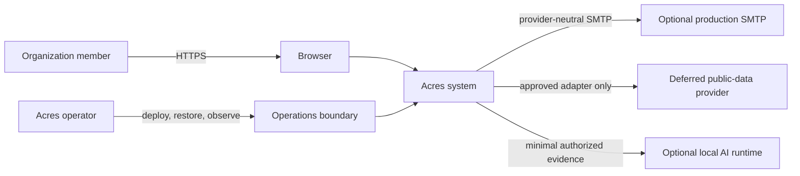
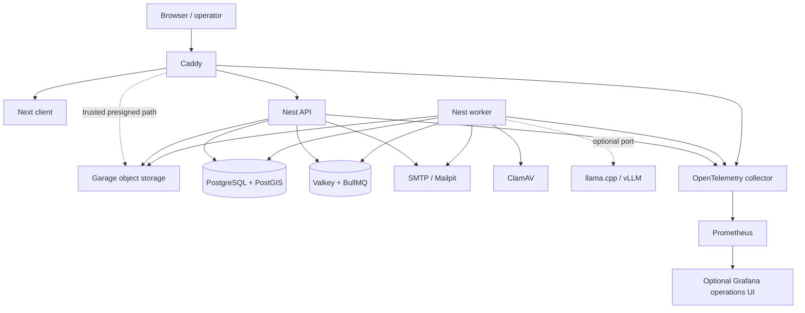
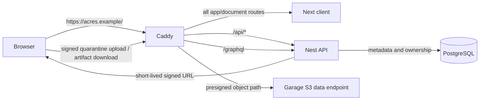
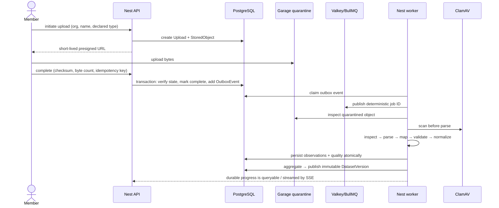
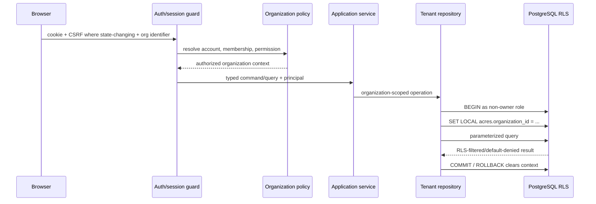
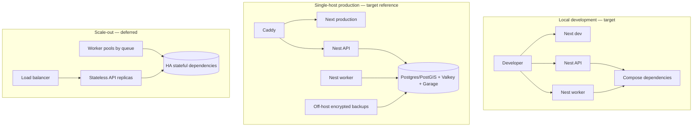

# Acres system architecture

Status: canonical target blueprint, approved 2026-08-23.

> **State legend.** **Current** means the capability exists in this repository
> and is evidenced by code. **Target** means an approved design that has not yet
> necessarily been built. **Deferred** means explicitly outside the current
> build. No target control in this document may be described as deployed.

The implementation sequence is in [`build-plan.md`](build-plan.md), current API
facts are in [`backend.md`](backend.md), product behavior is in
[`product.md`](product.md), and risks are in [`security.md`](security.md).

## 1. Decision record and source basis

The decisions in this document are the architecture record for the approved
2026-08-23 blueprint. A replacement must name the decision, explain trade-offs
and migration, obtain user approval, and change this document and affected
plans in the same commit. Superseded choices remain visible through git history.

Repository evidence inspected for this decision: `AGENTS.md`, `README.md`, all
workspace manifests, `skills-lock.json`, the current Prisma schema, Nest module
and application setup, feature controllers/modules, shared contracts, server
tests, CI, Dockerfile, `docs/backend.md`, and `docs/landing.md`.

Official sources were rechecked on 2026-08-23: [Node releases](https://nodejs.org/en/about/previous-releases),
[Nest versioning](https://docs.nestjs.com/techniques/versioning),
[Nest OpenAPI](https://docs.nestjs.com/openapi/introduction),
[Nest GraphQL](https://docs.nestjs.com/graphql/quick-start),
[Nest SSE](https://docs.nestjs.com/techniques/server-sent-events),
[Nest queues](https://docs.nestjs.com/techniques/queues),
[Prisma releases](https://www.npmjs.com/package/prisma),
[PostgreSQL RLS](https://www.postgresql.org/docs/current/ddl-rowsecurity.html),
[PostGIS spatial data](https://postgis.net/docs/using_postgis_dbmanagement.html),
[Valkey](https://valkey.io/topics/introduction/),
[BullMQ](https://github.com/taskforcesh/bullmq),
[Garage](https://github.com/deuxfleurs-org/garage),
[MinIO licensing](https://docs.min.io/license/),
[OpenTelemetry JS](https://opentelemetry.io/docs/languages/js/),
[Prometheus](https://prometheus.io/docs/introduction/overview/), and
[Caddy automatic HTTPS](https://caddyserver.com/docs/automatic-https).

## 2. Binding architecture principles

1. Start as a modular monolith. Extract a service only after measured scaling,
   isolation, or independent-deployment pressure justifies the cost.
2. Keep one repository and shared domain/application code, with separately
   runnable API and worker processes.
3. A feature module owns its data and application services. Other modules call
   its public interface; they do not query its tables directly.
4. Controllers and resolvers are transport adapters. Domain rules and Prisma
   queries do not live in them.
5. Application services depend on ports. Prisma, object storage, queues, mail,
   telemetry, clocks, and optional AI are adapters wired by Nest DI.
6. PostgreSQL is authoritative. Valkey accelerates and transports work; it is
   never the only record of product state.
7. Every tenant-owned row is organization-scoped and tested for negative
   cross-tenant access in application code and PostgreSQL RLS.
8. Source files and generated artifacts live in object storage. PostgreSQL
   stores ownership, lifecycle, checksum, version, and evidence metadata.
9. Deterministic analytics work without AI. AI can propose drafts only from
   explicit authorized evidence.
10. Contracts, migrations, permissions, and state transitions are explicit and
    mechanically tested. Hidden framework behavior is not an architecture.

## 3. System views

### 3.1 System context

`DataProvider` and `AI` are optional boundaries. A provider connector needs a
named source and approved license. AI is disabled by default and no core
journey depends on it.

### 3.2 Runtime containers

Only Caddy is internet-exposed in the reference production profile. Database,
queue, storage admin API, scanner, telemetry, and AI remain private. Garage data
paths are exposed only through scoped, short-lived presigned requests.

### 3.3 Same-origin HTTP routing

Cookie-authenticated application traffic is same-origin. Presigned storage is
an explicit trust-boundary crossing: the API authorizes the object identity and
operation; Caddy proxies only the intended object path, and Garage enforces
signature, expiry, method, and object key. Browser code never receives storage
administrator credentials.

### 3.4 Upload and ingestion sequence

Each arrow after completion represents a durable, idempotent stage, not one
long in-memory transaction. Publication is the only point that makes a version
available to analytical reads.

### 3.5 Tenant and RLS request flow

### 3.6 Deployment profiles

The local profile activates dependencies as phases need them. The production
reference is Docker Compose plus Caddy on one host with off-host backups. The
scale-out drawing is a seam, not a commitment to Kubernetes, a cloud, or a
managed service.

## 4. Runtime component and FOSS inventory

This is an engineering inventory, not legal advice. License obligations must
be reviewed before distribution or hosted production. Versions are target
baselines, not permission for an unreviewed upgrade.

| component / state | responsibility | failure effect | persistence / backup | exposure / scaling unit | selected license and replacement seam |
| --- | --- | --- | --- | --- | --- |
| Node 24 LTS **current** | JS runtime for build, API, worker, Next | Affected process unavailable | None; reproducible image | Private process; scale API/worker separately | MIT terms for Node-maintained code plus bundled third-party licenses; OCI/runtime seam. Node 26 Current is not approved |
| Next.js 16.3 + React 19.2 **current** | Marketing client; later authenticated web UI | Browser UI unavailable; API may remain healthy | Built assets/config; source in git | Through Caddy; stateless replicas | MIT; HTTP API boundary permits another web client |
| NestJS 11.2/Express API **current**, worker **target** | REST/GraphQL/SSE transports and application orchestration; background processors | API failure blocks commands/reads; worker failure delays jobs | No sole state; drain in-flight work | Through Caddy for API; worker private; scale independently | MIT; ports/application services isolate adapters |
| Prisma 7.9.1 **current** | Relational adapter and generated client | DB operations fail | Schema and first migration (`server/prisma/migrations/20260823204922_init`) are in git, generated/reviewed against a real Postgres — landed by `prompts/18-database-infrastructure.md` | Private library; scale with process and pool | Apache-2.0; repository ports. Prisma 8 RC is **deferred** until GA and a migration prompt |
| PostgreSQL + PostGIS **current** for local/CI, **target** for a production host | Authoritative tenant, lineage, analytics, job/outbox, audit, spatial state | Product data unavailable | Local/CI: `docker-compose.yml` volume, disposable by design. Production PITR/base backups, restore tests, and the volume-encryption/key-recovery contract (`docs/backend.md` §8.1) remain phase 12 | Private; primary/replica or partition only from measured need | PostgreSQL License + GPL-2.0-or-later PostGIS; SQL/repository boundary |
| Valkey + BullMQ **target** | Durable queue transport, ephemeral cache, coordination | Commands persist in PG but work/progress pauses | AOF/RDB appropriate to recovery; never sole product state | Private/authenticated; `noeviction`; scale worker concurrency/queues | BSD-3-Clause Valkey + MIT BullMQ; queue port. Verify exact BullMQ/Valkey adapter in phase 6 |
| Garage **target** | S3-compatible quarantine/source/export object storage | Upload/download and ingestion artifacts unavailable | Required multi-copy/object backup policy and restore/reconcile test | Private admin; scoped signed data path; scale storage nodes | AGPL-3.0; S3-compatible object-store port |
| ClamAV **target** | Scan untrusted files before parsing | Ingestion fails closed; browsing published data continues | Signatures/cache are replaceable; source files stay quarantined | Private worker dependency; scale scanner replicas | GPL-2.0 with documented OpenSSL exception; malware-scanner port |
| Caddy **target** | TLS, same-origin routing, request limits/timeouts, security headers | Public application unavailable | Config and certificate storage; back up config, preserve cert data | Only public ingress; scale/replace at proxy boundary | Apache-2.0; standard HTTP reverse-proxy seam |
| OpenTelemetry **target** | Vendor-neutral traces/metrics/log correlation | Reduced diagnosis; product work should degrade safely | Collector config in git; telemetry retention external | Private collector; scale collectors | Apache-2.0; OTLP seam. JS logs/browser signals require maturity review |
| Prometheus **target** | Operational time-series and alerts | Metrics/alerts unavailable; never billing/product truth | Retention/backup chosen operationally | Private or operator-authenticated; shard only from need | Apache-2.0; metrics scrape/remote-write seam |
| Grafana **optional target** | Operator dashboards over telemetry | Visual operations view unavailable | Provisioned dashboards/config in git | Operator-only | AGPL-3.0-only; dashboard consumer is replaceable |
| Mailpit **development target** / SMTP **production target** | Local email inspection / provider-neutral delivery | Invitations/recovery notifications delayed or fail | Mailpit data disposable; notification state in PG | Private dev UI; production outbound SMTP | Mailpit MIT; `MailPort` hides provider |
| llama.cpp CPU / vLLM GPU **optional target** | Local schema-constrained narrative drafts | AI drafts unavailable; deterministic product unaffected | Model artifacts/license records and generation metadata | Private; scale by model/runtime capacity | llama.cpp MIT / vLLM Apache-2.0; one `AiGenerationPort` |

MinIO is rejected as the reference implementation: its current default terms
permit unpaid non-production internal evaluation rather than the selected FOSS
production use. A future replacement needs a license and migration review.

License evidence was reopened on 2026-08-23. The current JS package identifiers
also match local manifests: Next.js 16.3.1/React 19.2.8/Nest 11.2.1 are MIT and
Prisma CLI/client 7.9.1 are Apache-2.0.

- [Node v24 license](https://github.com/nodejs/node/blob/v24.x/LICENSE): MIT
  terms for Node-maintained code plus the bundled third-party licenses listed in
  the same file; a Node image is not represented as one SPDX-only artifact.
- [Next.js 16.3.1](https://github.com/vercel/next.js/blob/v16.3.1/license.md),
  [React 19.2](https://github.com/facebook/react/blob/v19.2.0/LICENSE), and
  [NestJS 11.2.1](https://github.com/nestjs/nest/blob/v11.2.1/LICENSE): MIT.
- [Prisma 7.9.1](https://github.com/prisma/prisma/blob/7.9.1/LICENSE):
  Apache-2.0 for the selected Prisma packages; an image scan must still retain
  transitive notices.
- [PostgreSQL](https://www.postgresql.org/about/licence/) uses the PostgreSQL
  License; [PostGIS](https://github.com/postgis/postgis/blob/master/COPYING) is
  GPL-2.0-or-later.
- [Valkey](https://valkey.io/topics/introduction/) is BSD-3-Clause;
  [BullMQ](https://github.com/taskforcesh/bullmq/blob/master/LICENSE) is MIT;
  the [Garage repository](https://github.com/deuxfleurs-org/garage) identifies
  Garage as AGPL-3.0 free software.
- [ClamAV](https://github.com/Cisco-Talos/clamav/blob/main/COPYING.txt) uses
  GPL-2.0 with its documented OpenSSL linking exception; do not collapse the
  exception out of a distribution review.
- [Caddy](https://github.com/caddyserver/caddy/blob/master/LICENSE),
  [OpenTelemetry JS](https://github.com/open-telemetry/opentelemetry-js/blob/main/LICENSE),
  and [Prometheus](https://github.com/prometheus/prometheus/blob/main/LICENSE)
  are Apache-2.0.
- [Grafana's licensing record](https://github.com/grafana/grafana/blob/main/LICENSING.md)
  says the default is AGPL-3.0-only with named Apache-2.0 exceptions;
  [Mailpit](https://github.com/axllent/mailpit/blob/develop/LICENSE) is MIT.
- [llama.cpp](https://github.com/ggml-org/llama.cpp/blob/master/LICENSE) is MIT;
  [vLLM](https://github.com/vllm-project/vllm/blob/main/LICENSE) is Apache-2.0.
- [MinIO's official terms](https://docs.min.io/license/) support the rejection
  above. This inventory still requires legal review for the actual versions,
  container contents, modifications, distribution, and deployment model.

## 5. Modular-monolith boundaries

### 5.1 Target modules

| module | owns | may expose |
| --- | --- | --- |
| Identity / sessions | `Account`, credentials, verification/reset tokens, `Session` | Account principal, authentication/session commands |
| Organizations | `Organization`, `Membership`, `Invitation`, permission policy, optional entitlement | Active-org resolution and permission decisions |
| Geography | Global `Region`, hierarchy, aliases, sources, geometry | Region lookup/matching and spatial queries |
| Datasets / ingestion | `Dataset`, `DatasetVersion`, upload/mapping/run/issues | Upload and ingestion commands/status; published-version identity |
| Analytics | `MetricDefinition`, `Observation`, quality flags, aggregates | Typed read models and deterministic calculations |
| Dashboards | `Dashboard`, `SavedView` | Organization-scoped saved analytical presentation |
| Reports | `Report`, `ReportRevision`, `Insight`, evidence links | Draft/publish workflow and reproducible revisions |
| Exports | `Export`, generated `StoredObject` artifact | Authorized export command/status/download |
| Jobs / outbox / schedules | `JobRun`, `OutboxEvent`, scheduling leases | Durable dispatch, progress, cancellation, reconciliation |
| Notifications | `Notification` and delivery attempts | Provider-neutral requested delivery |
| Audit / admin | `AuditEvent`, governed operator actions | Append event and authorized audit reads |
| Optional AI | `AiGeneration`, prompt/evaluation metadata | Evidence-constrained draft generation only |
| Infrastructure | Health, config, security, telemetry, Prisma/queue/storage/mail adapters | Framework wiring; no product policy ownership |

Dependencies point from transports to application services to module-owned
domain ports. Infrastructure implements ports. Cross-module calls go through a
published application interface or event. Shared code contains stable types and
cross-cutting primitives only; it is not a dumping ground for entities.

### 5.2 Current-to-target bridge

- **Current** `accounts`, `auth`, and `sessions` become the identity boundary;
  their opaque hashed database sessions remain the starting mechanism.
- **Current** `regions` seeds the geography module; the existing flat fields are
  not evidence that hierarchy or PostGIS is already implemented.
- **Current** `jobs` becomes the read side of jobs/outbox/schedules. The
  in-process session cleanup schedule is replaced only after the worker and
  durable scheduling design exists.
- **Current** `forms` remains a public marketing/contact boundary and must not
  be confused with organization product data.
- **Current** Prisma access is service-oriented but not yet organized behind
  every target repository port. Migration occurs phase by phase; no big-bang
  directory rewrite is required.

## 6. Target data model

### 6.1 Type and relational rules

- Use UUIDv7 for new opaque public identifiers; legacy UUID identifiers can
  coexist until an explicit migration. Never expose sequential internal keys.
- Use `timestamptz` for events and lifecycle timestamps and define UTC display
  behavior at the client.
- Use `double precision` for ordinary measured values. Use `numeric(p,s)` only
  where exact decimal semantics are required and record conversion rules.
- An observation has exactly one compatible value representation. Checks must
  prohibit ambiguous numeric/text/boolean/null combinations.
- Index every foreign key used for relation/query paths; validate additions
  with representative `EXPLAIN (ANALYZE, BUFFERS)` rather than indexing every
  column speculatively.
- Scope tenant uniqueness to `organization_id`; global reference uniqueness is
  explicitly global.
- Use JSONB only for variable dimensions or source metadata. Known fields,
  ownership, lifecycle, permissions, values, and evidence relations stay typed.
- Prisma does not natively author the required PostGIS and RLS SQL. Reviewed
  SQL migrations and real-database integration tests own that boundary.

### 6.2 Aggregates, constraints, deletion, and query paths

| aggregate | required records and constraints | deletion behavior | principal query/index paths |
| --- | --- | --- | --- |
| Identity | `Account` unique normalized email; password hash; `Session` unique hash/expiry/revocation; single-use hashed verification/reset tokens with purpose and expiry | Revoke sessions/tokens; account deletion/anonymization policy is open and must preserve required audit provenance | email login; session hash + active expiry; token hash + unused expiry |
| Tenancy | `Organization`; unique membership `(organization_id, account_id)`; invitation token hash, normalized email, role, expiry, accepted/revoked state; optional entitlement without billing provider | Last owner protected; revoke membership rather than silently cascading authored history; org deletion policy open | account organizations; org members by role/status; invitation hash/email; org-scoped permission checks |
| Geography | Global arbitrary-depth `Region` with parent, level/type, stable external codes per source, aliases, provenance; separate PostGIS geometry/boundary table where Prisma needs unsupported columns/raw SQL | Reference regions retire/version rather than cascade-delete evidence; geometry updates retain provenance | parent/child; ancestor/descendant strategy selected in phase 7; code/alias match; GiST geometry and bounding/spatial queries |
| Ingestion | `Dataset`; immutable published `DatasetVersion`; `StoredObject`; `Upload`; versioned `ColumnMapping`; `IngestionRun`; bounded `ValidationIssue` summaries/details. A failed attempt creates/updates its run and issues, not a dataset version | Deleting a draft may remove unreferenced objects; published versions referenced by evidence cannot be mutated; retention drives later purge | org datasets; published version sequence; upload checksum/state; run/stage/job; issues by severity/row/column |
| Analytics | `MetricDefinition` semantic key/type/unit/aggregation; `Observation` by org/version/region/metric/period/dimensions; quality flags and aggregate lineage | Source/version lifecycle governs data; published evidence prevents untracked destructive change | `(organization_id, metric_id, region_id, period)`; version; region hierarchy; normalized dimension hashes; aggregate lookup |
| Presentation | `Dashboard`, `SavedView`; `Report`, immutable `ReportRevision`, `Insight`; evidence joins to immutable version/observation identities | Drafts may be archived; published revisions and evidence are append-only except governed redaction/tombstone | org + status/owner; dashboard/view slug; report + revision; evidence reverse lookup |
| Operations | `Export`, `JobRun`, `OutboxEvent`, `Notification`, `AuditEvent`; optional `AiGeneration` | Retention policy may purge artifacts/payloads while retaining minimal audit identity; outbox deletion only after verified dispatch window | pending outbox with lock/attempt; job state/time; exports by requester/state; audit by org/actor/action/time; AI by report/version |

## 7. Tenant isolation and database identities

The first line of defense is an organization-scoped repository API. Tenant
roots and children carry `organization_id` wherever direct policy evaluation
or common query paths require it; a distant join is not accepted as the only
scope for a high-risk table.

The database adds independent enforcement:

- tenant tables use `ENABLE ROW LEVEL SECURITY` and `FORCE ROW LEVEL SECURITY`;
- the API runs as a non-owner role and starts a transaction before applying
  `SET LOCAL acres.organization_id = '<uuid>'`;
- missing/invalid tenant context yields default deny; policies do not substitute
  a default organization;
- transaction completion clears context before pooled connection reuse;
- a separate constrained worker role handles tenant jobs; any cross-tenant
  system job uses an explicit allowlisted code path and emits an audit event;
- migration/table-owner credentials are unavailable to API and worker images;
- integration tests use two organizations and attempt cross-tenant reads,
  writes, updates, deletes, relation traversal, GraphQL node lookup, exports,
  pooled transaction reuse, and background jobs.

PostgreSQL owners normally bypass RLS, which is why `FORCE` and non-owner
runtime roles are both mandatory. Application permission checks still decide
whether an authorized member may perform an operation inside the tenant.

## 8. Interface contracts

### 8.1 Responsibility split

| capability | REST `/api/v1` | GraphQL `/graphql` | progress/event |
| --- | --- | --- | --- |
| Health | `/health` remains unversioned | none | none |
| Auth, session, CSRF, recovery | commands and reads | none | none |
| Organizations, membership, invitations | commands and required administration reads | optional later read models only | none |
| Uploads and ingestion | initiate/complete/cancel/status and mapping commands | dataset/version read models | SSE for bounded progress |
| Regions and metrics | administrative commands only where needed | primary read-heavy exploration | none initially |
| Dashboards and reports | command/publish/export boundaries | primary authorized reads | SSE for export progress |
| Jobs and exports | control/status/download | related read models only | SSE |
| Webhooks/admin mutations | REST only | none | inbound signed webhooks only if added |

GraphQL is initially authenticated and read-only. It is not duplicate CRUD.
Both transports call the same permission policies and application services;
resolvers do not call REST or Prisma.

### 8.2 Cross-transport rules

- REST uses URI versioning at `/api/v1`; `/health` remains unversioned.
- Generate OpenAPI from reviewed Nest decorators, commit the artifact, and fail
  CI on unintended drift. Each phase still reviews actual DTO fields.
- Generate code-first GraphQL SDL deterministically and check breaking drift.
- GraphQL uses opaque cursor pagination, per-request tenant context and
  DataLoaders, plus query-byte, depth, complexity, timeout, pagination, and
  result-size limits. GraphiQL and verbose errors are development-only.
- Production introspection is an explicit deployment choice, never an
  authorization mechanism.
- Commands safe to retry accept an idempotency key scoped to principal,
  organization, operation, request hash, and expiry. Same key/same body replays
  the recorded outcome; same key/different body conflicts.
- Mutable collaborative resources expose a version or ETag and reject stale
  writes. Cursor contents are implementation-private.
- REST errors expose stable code, safe message/details, and request ID.
  GraphQL errors expose sanitized messages with `extensions.code` and request
  ID. Internal stack/data remains in redacted structured logs.
- `packages/shared` remains framework-neutral; Nest/Apollo decorators do not
  leak into it.
- Production is same-origin behind Caddy. Phase 5 must verify the installed
  Next 16.3 proxy, cookie, header, cache, and server-fetch APIs from
  `node_modules/next/dist/docs/` before writing client integration.

## 9. Upload, queue, and ingestion state machine

### 9.1 States and stages

An upload moves through `initiated → uploading → quarantined → scanning →
accepted | rejected | expired`. An ingestion run moves through `queued →
inspecting → scanning → parsing → mapping → validating → normalizing →
persisting → aggregating → publishing → succeeded`, with `failed`, `cancelled`,
and `dead_lettered` terminal branches. Exact enum names are reviewed in phase 6.

Required mechanics:

- issue a short-lived presigned upload for an organization/upload-derived
  quarantine key; never use a raw filename as a path;
- keep original filename as escaped metadata only; compare declared extension,
  declared media type, signature/detected type, byte count, and checksum;
- bound compressed expansion, nesting, byte/row/column counts, parser memory,
  CPU/time, geometry coordinate/ring/feature complexity, and validation detail;
- scan before parse and fail closed when scanning times out or is unavailable;
- keep every stage idempotent and restartable with deterministic job identity;
- classify failures as retryable dependency/transient errors or terminal
  validation/security errors; cap retries and send exhausted work to a visible
  dead-letter state;
- persist cancellation requests and progress; never rely on an SSE connection
  for state;
- publish queue work through a transactional outbox written with authoritative
  PostgreSQL state. Dispatch claims use locking, bounded retry, and metrics;
- queue payloads contain opaque IDs and versions, not datasets, secrets, signed
  URLs, or sensitive prompts;
- reconcile orphan objects, missing objects, stale uploads, undispatched outbox
  rows, and abandoned jobs on auditable schedules;
- render untrusted text through safe React interpolation and download risky
  formats as attachments; prefix spreadsheet formula-leading cells according to
  the reviewed export policy;
- keep source versions immutable. Normalize/persist in staging and publish only
  after all required checks and aggregate work succeed.

Valkey and Garage use private networking and authentication. Valkey uses
`noeviction`; product state remains recoverable from PostgreSQL and object
storage. Retention windows, byte/shape limits, concurrency, retry counts, and
timeouts are launch inputs, not invented constants in this blueprint.

## 10. Optional AI boundary

AI is **target-optional**, disabled by default, and non-authoritative. It cannot
authorize, mutate source data, publish reports, execute arbitrary tools, fetch
arbitrary URLs, or bypass tenant policy.

The deterministic reports service selects a minimal set of authorized evidence
and sends it through `AiGenerationPort` with a versioned prompt and structured
schema. The adapter returns a schema-validated draft. Persistence records the
model and model-license record, runtime, prompt version, organization,
dataset/report revision, evidence IDs, timestamps, output, evaluation result,
and human publication decision.

The boundary requires tenant-bound context, prompt-injection and data-leakage
tests, unsupported-claim/evidence checks, output-size and concurrency limits,
timeouts and circuit breaking, cancellation, and metrics that exclude raw
sensitive prompts by default. Failure returns the same human-authored workflow;
it never blocks deterministic browsing, reporting, or exporting. RAG, a vector
database, hosted proprietary inference, and autonomous actions are deferred.

## 11. Operations and deployment

### 11.1 Configuration and secrets

Configuration is schema-validated at process boot. Non-secret config may ship
in versioned examples; secrets are injected at runtime/CI from a dedicated
secret store or protected host mechanism, never `NEXT_PUBLIC_*`, images,
Compose files, logs, queue payloads, or git. API, worker, migration, storage,
SMTP, and telemetry identities are separate and least-privileged. Rotation and
compromise response are tested before launch.

TLS protects production traffic in transit. PostgreSQL and Garage live data use
operator-managed host/block-volume encryption in the single-host reference;
application-level field encryption is not implied. Unlock material is stored
separately from data volumes and backups. Phase 2 owns the database-volume and
key-recovery contract, phase 6 extends it to Garage, and phase 12 inspects the
production mounts, documents rotation/recovery, and gates launch. Local
development may use unencrypted disposable volumes when clearly labelled.

### 11.2 Health and shutdown

- **Liveness** answers whether the process/event loop can serve; it does not
  block on every dependency.
- **Readiness** fails when a dependency required for that process's declared
  work is unavailable or migrations are pending.
- The API stops accepting traffic and drains bounded in-flight requests.
- The worker stops claiming jobs, extends/finishes safe work or records a
  recoverable retry point, then closes queue/database/storage clients.
- Caddy and orchestrator timeouts exceed the application's drain budget.

### 11.3 Backup and recovery

PostgreSQL, Garage objects, deployment config, encryption/signing material
where recoverable, and certificate state have documented backup ownership.
Backups are encrypted, access-controlled, off-host, and restored in scheduled
tests. Restoration includes migration compatibility plus DB/object
reconciliation. Valkey is persisted for queue recovery but is not treated as
the only product ledger. RPO and RTO are user/operator-owned launch values.

### 11.4 Observability and launch signals

Use structured logs with request, trace, organization-safe opaque, job, and
stage IDs; redact cookies, authorization, secrets, raw uploads, contact content,
and AI prompts. OpenTelemetry supplies correlation. Prometheus stores
operational numeric time series, not exact product or billing truth. Grafana is
an optional operator UI, not the Acres customer dashboard.

Alert classes cover public/API availability, database/storage/queue readiness,
outbox lag, queue age/dead letters, ingestion failure and scan timeout rates,
disk/object capacity, backup/restore failure, auth abuse, elevated 5xx/latency,
and telemetry pipeline loss. Thresholds need a measured baseline.

Scale or partition only from capacity signals: API saturation/latency, worker
queue age and stage concurrency, database CPU/I/O/locks/query plans/table size,
object capacity/throughput, Valkey memory/latency/eviction, scanner saturation,
and AI runtime utilization. Kubernetes, Terraform, cloud/provider-specific
services, multi-region operation, and service extraction remain deferred.

## 12. Deferred decisions and change gates

Before launch, owners must select measurable upload/parser/job limits, SLOs,
RPO/RTO, retention, geography sources/licenses, SMTP, backup destinations,
audit access, and production introspection policy. Any move to microservices,
Prisma 8, a different object store, hosted AI, public connectors, GraphQL
mutations/subscriptions, Kubernetes, or cloud-managed dependencies requires an
explicit decision and migration plan rather than incidental implementation.
